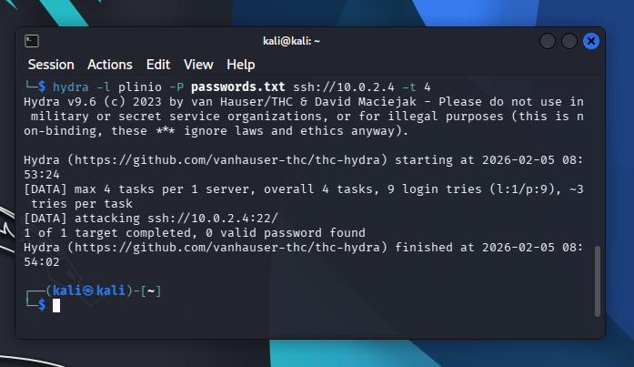
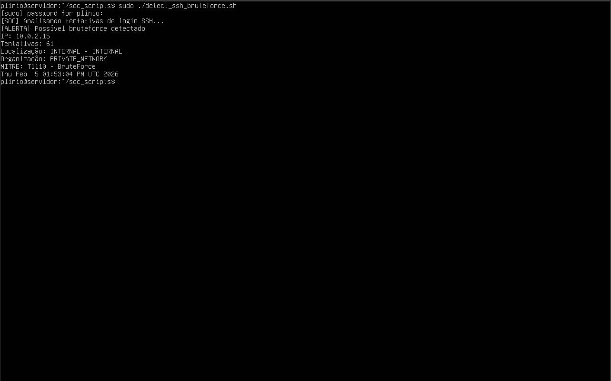
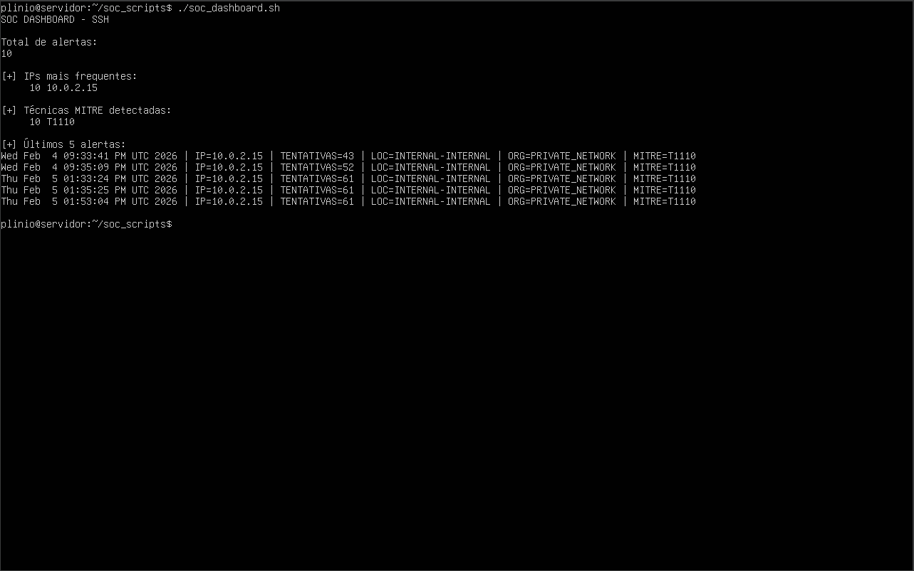
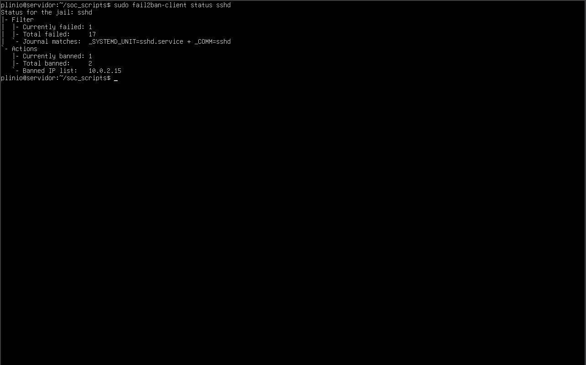
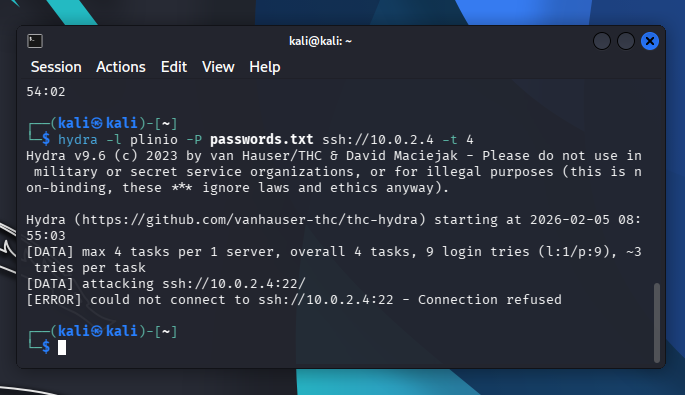

# SOC SSH Brute Force – Detection, Response & Hardening

## Visão Geral

Este projeto simula um **cenário real de SOC (Security Operations Center)** focado na **detecção, análise e resposta a ataques de força bruta em SSH**, utilizando logs reais do sistema, automação defensiva e validação prática da mitigação.

O laboratório foi construído para demonstrar o ciclo completo de um incidente de segurança:

> **Ataque → Detecção → Análise → Resposta → Hardening → Validação**

Tudo foi executado em ambiente isolado e controlado.

---

## Cenário do Laboratório

- **Servidor monitorado:** Ubuntu Server
- **Atacante simulado:** Kali Linux
- **Rede:** NAT Network (ambiente isolado)
- **Serviço alvo:** SSH
- **Ataque:** Brute Force via Hydra
- **Resposta automática:** Fail2Ban
- **Mapeamento:** MITRE ATT&CK

---

## Ataque Simulado (Red Team)

O ataque foi realizado a partir da máquina Kali Linux utilizando o **Hydra**, simulando um cenário clássico de brute force em SSH.

O ataque gera múltiplas falhas de autenticação no servidor, alimentando os logs monitorados pelo SOC.

---

## Detecção (SOC)

A detecção é baseada na análise do arquivo: /var/log/auth.log 

Critérios utilizados:
- Múltiplas falhas de autenticação
- Agrupamento por IP de origem
- Análise de volume e recorrência
- Geração de alerta quando o limiar é excedido

---

## Mapeamento MITRE ATT&CK

A atividade detectada foi classificada como:

- **T1110 – Brute Force**

Este mapeamento permite padronizar a detecção e facilita correlação com outros eventos de segurança.

---

## Dashboard SOC

Foi desenvolvido um **dashboard em Shell Script** para visualização rápida do estado do ambiente, simulando a rotina de um analista SOC.

O dashboard exibe:
- Total de alertas
- IPs mais frequentes
- Técnicas MITRE detectadas
- Últimos eventos registrados

---

## Resposta e Hardening

Após a confirmação do incidente:

- O ataque é classificado como brute force
- O IP atacante é automaticamente bloqueado via **Fail2Ban**
- O serviço SSH passa a recusar conexões do atacante
- O evento é registrado para auditoria

---

## Validação da Mitigação

Após o bloqueio:

- Uma nova tentativa de ataque é realizada
- O atacante não consegue mais estabelecer conexão
- O serviço SSH retorna **Connection Refused**

Isso valida que a resposta foi eficaz.

---

## Playbook SOC

O projeto inclui um **playbook de resposta a incidentes**, contendo:

- Descrição do incidente
- Critérios de detecção
- Etapas de análise
- Resposta inicial
- Hardening aplicado
- Mapeamento MITRE ATT&CK

Este documento simula playbooks utilizados em SOCs reais.

---

## Objetivo do Projeto

Este projeto foi desenvolvido com foco em:

- SOC Analyst
- Blue Team
- Detecção e resposta a incidentes
- Automação defensiva
- Análise de logs
- Integração entre visão ofensiva e defensiva

---

## Observações Importantes

- Todo o ambiente foi criado **exclusivamente para fins educacionais**
- A rede utilizada é isolada
- Nenhuma atividade foi realizada fora do laboratório

